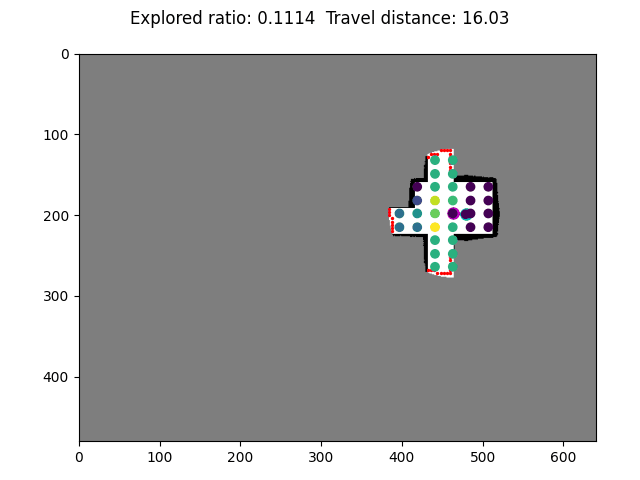
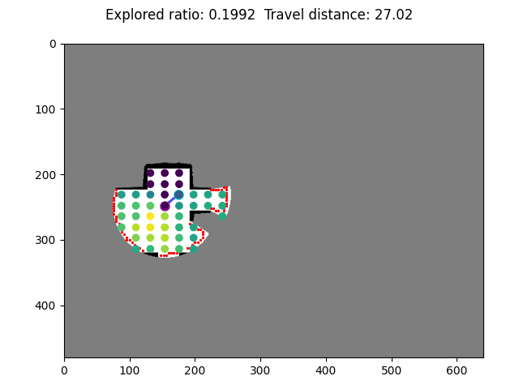
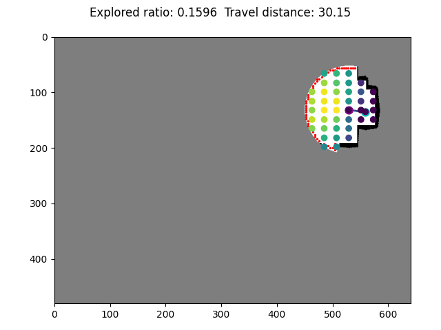
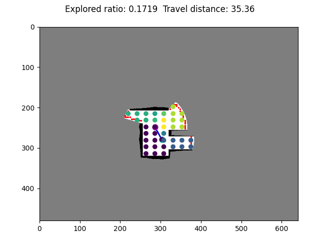

# ARiADNE
 Public code and model of <a href="https://arxiv.org/pdf/2301.11575.pdf">ARiADNE: A Reinforcement learning approach using Attention-based Deep Networks for Exploration</a>, which is accepted for the oral presentation at ICRA 2023.

## Run

#### Dependencies
* `python == 3.10.8`
* `pytorch == 1.12.0`
* `ray == 2.1.0`
* `scikit-image == 0.19.3`
* `scikit-learn == 1.2.0`
* `scipy == 1.9.3`
* `matplotlib == 3.6.2`
* `tensorboard == 2.11.0`


#### Training
1. Set training parameters in `parameters.py`.
2. Run `python driver.py`

#### Evaluation
1. Set parameters in `test_parameters.py`.
2. Run `test_driver.py`

## Files
* `parameters.py` Training parameters.
* `driver.py` Driver of training program, maintain & update the global network.
* `runner.py` Wrapper of the local network.
* `worker.py` Interact with environment and collect episode experience.
* `model.py` Define attention-based network.
* `env.py` Autonomous exploration environment.
* `graph_generator.py` Generate and update the collision-free graph.
* `node.py` Initialize and update nodes in the coliision-free graph.
* `sensor.py` Simulate the sensor model of Lidar.
* `/model` Trained model.
* `/DungeonMaps` Maps of training environments provided by <a href="https://github.com/RobustFieldAutonomyLab/DRL_robot_exploration">Chen et al.</a>.

### Demo of ARiADNE

<figure>
    <center>
    <tr>
    
    
    </tr>
    <br></br>
    <tr>
    
    
    </tr>
</figure>

### Cite
If you find our work helpful or enlightening, feel free to cite our paper:
```
@article{cao2023ariadne,
  title={Ariadne: A reinforcement learning approach using attention-based deep networks for exploration},
  author={Cao, Yuhong and Hou, Tianxiang and Wang, Yizhuo and Yi, Xian and Sartoretti, Guillaume},
  journal={arXiv preprint arXiv:2301.11575},
  year={2023}
}
```

### Authors
[Yuhong Cao](https://github.com/caoyuhong001)\
Tianxiang Hou\
[Yizhuo Wang](https://github.com/wyzh98)\
Xian Yi\
[Guillaume Sartoretti](https://github.com/gsartoretti)
